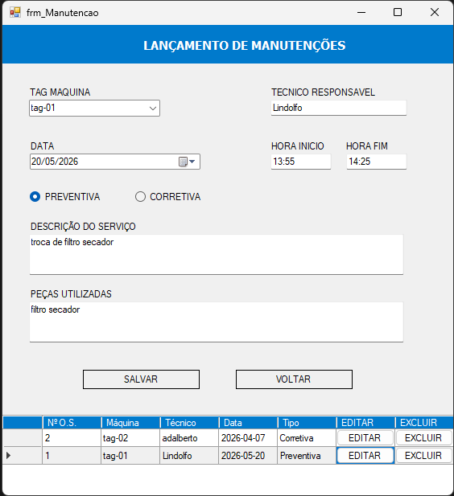

# 🛠️ Controle de Manutenção de Máquinas

Sistema desenvolvido em **VB.NET** para gestão de maquinário industrial e controle de ordens de serviço (preventivas e corretivas).

## 🚀 Funcionalidades
- Cadastro completo de máquinas com foto.
- Filtro de pesquisa em tempo real.
- Edição e exclusão de registros direto no Grid.
- Lançamento de Ordens de Serviço (O.S.).
- Banco de dados integrado.

## 💻 Tecnologias
- Visual Basic .NET
- Banco de Dados (SQL Server / Access via ADODB)
- Windows Forms

### 📸 Demonstração do Sistema

#### Tela de Cadastro

#### Lançamento de O.S.

